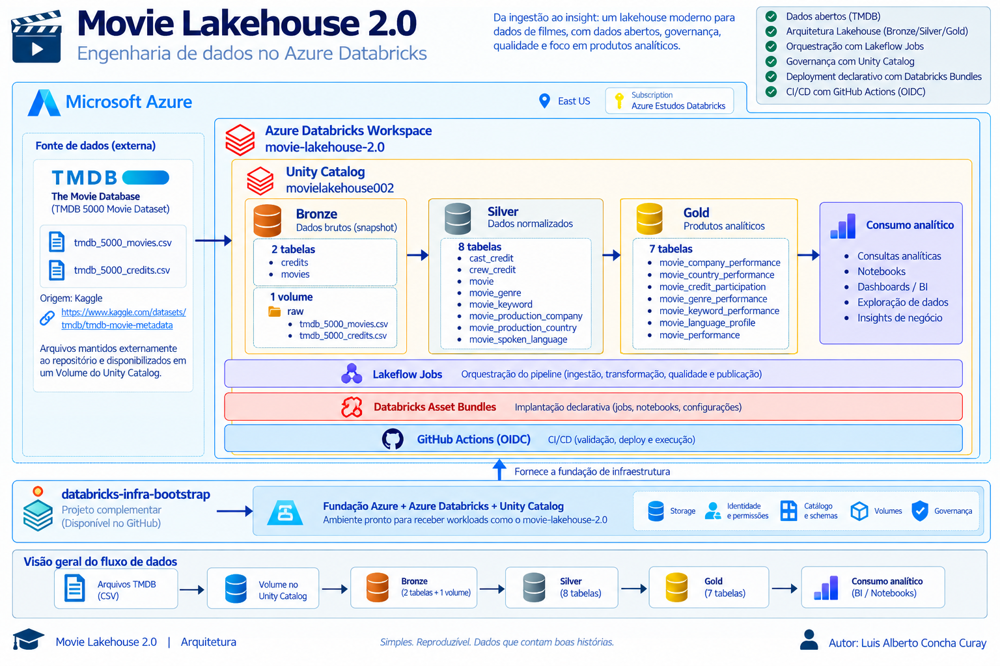

# movie-lakehouse-2.0




Projeto de engenharia de dados construído no Azure Databricks com arquitetura medalhão **Bronze → Silver → Gold**, orientado principalmente ao consumo analítico e BI.

## Objetivo

O `movie-lakehouse-2.0` transforma os arquivos TMDB 5000 em produtos de dados governados pelo Unity Catalog, com contratos explícitos, validações de qualidade, orquestração produtiva, deployment declarativo e CI/CD.

O projeto foi construído com foco em:

- responsabilidades claras entre Bronze, Silver e Gold;
- qualidade e contratos verificáveis;
- reexecução e recuperação por comportamento comprovado;
- separação entre aplicação e fundação da plataforma;
- deployment reproduzível com Databricks Declarative Automation Bundles;
- orquestração com Lakeflow Jobs;
- CI/CD com GitHub Actions e autenticação OIDC;
- rastreabilidade das principais decisões técnicas.

## Arquitetura

O fluxo produtivo é:

```text
Arquivos TMDB externos
        ↓
      Bronze
        ↓
      Silver
        ↓
       Gold
        ↓
 Analistas / BI
```

- **Bronze:** preserva os dados de origem e metadados necessários à rastreabilidade.
- **Silver:** realiza tipagem, parsing, limpeza e normalização das entidades do domínio.
- **Gold:** publica produtos analíticos com grão, chave e semântica explicitamente definidos.

A execução produtiva é orquestrada pelo Lakeflow Job `movie_lakehouse_job`:

```text
bronze_ingestion
        ↓
silver_transformation
        ↓
    gold_build
```

Os notebooks de `_eda` são artefatos de investigação e validação e **não fazem parte do DAG produtivo**.

A descrição detalhada das responsabilidades, produtos e decisões arquiteturais está em [`docs/architecture.md`](docs/architecture.md).

## Fontes

A aplicação consome dois arquivos raw do dataset **TMDB 5000 Movie Dataset**, disponibilizado no Kaggle:

- `tmdb_5000_movies.csv`
- `tmdb_5000_credits.csv`

Origem: [TMDB 5000 Movie Dataset — Kaggle](https://www.kaggle.com/datasets/tmdb/tmdb-movie-metadata)

Os arquivos são mantidos externamente ao repositório e esperados em um Volume do Unity Catalog fornecido pela plataforma.

## Plataforma e responsabilidades

O `movie-lakehouse-2.0` assume uma fundação Azure Databricks previamente preparada como pré-requisito para execução da aplicação.

Essa fundação pode ser provisionada pelo projeto complementar [`databricks-infra-bootstrap`](https://github.com/luisconcha/databricks-infra-bootstrap), que automatiza a preparação dos recursos de infraestrutura necessários para receber workloads Databricks.

As responsabilidades permanecem separadas entre os projetos:

**`databricks-infra-bootstrap`**

- prepara a fundação Azure e Azure Databricks;
- provisiona os recursos de plataforma necessários aos workloads;
- estabelece identidade, storage, governança e permissões conforme sua própria configuração.

**`movie-lakehouse-2.0`**

- assume que os recursos necessários à execução já estão disponíveis;
- valida os pré-requisitos que consome antes da execução;
- executa ingestão, transformação, qualidade e publicação dos dados;
- implanta e executa somente os recursos pertencentes à aplicação;
- não provisiona infraestrutura nem concede ou corrige permissões durante o processamento.

O `movie-lakehouse-2.0` não depende de uma implementação específica para preparar sua infraestrutura. O [`databricks-infra-bootstrap`](https://github.com/luisconcha/databricks-infra-bootstrap) é o projeto utilizado e validado neste ecossistema para essa finalidade.

## Estrutura do repositório

```text
.
├── .github/workflows/
│   ├── ci.yml
│   └── cd.yml
├── notebooks/
│   ├── 01_bronze/
│   ├── 02_silver/
│   ├── 03_gold/
│   ├── _eda/
│   └── _shared/
├── resources/
│   └── movie_lakehouse_job.yml
├── scripts/
│   ├── provision_platform_prerequisites.sh
│   ├── validate_bundle_prerequisites.sh
│   └── validate_platform_contract.sh
├── docs/
│   ├── architecture.md
│   ├── runbook.md
│   └── project-history.md
├── databricks.yml
└── README.md
```

`provision_platform_prerequisites.sh` é uma ferramenta de apoio à preparação dos pré-requisitos externos da plataforma. Sua execução é administrativa e independente do workload: o script não integra o DAG nem representa autocorreção da aplicação.

## Configuração

O target lógico atualmente implementado é `dev`.

Os nomes lógicos estáveis de schemas e Volume são centralizados no Bundle:

```text
bronze_schema = bronze
silver_schema = silver
gold_schema   = gold
raw_volume    = raw
```

O catálogo físico é dependente do ambiente e deve ser fornecido externamente por `BUNDLE_VAR_catalog`.

Na execução local, o workspace e a autenticação podem ser selecionados por um profile da Databricks CLI:

```bash
export DATABRICKS_CONFIG_PROFILE=<profile-local-do-workspace>
export BUNDLE_VAR_catalog=<catalogo-do-ambiente>
```

Os notebooks produtivos recebem pelo Job somente os parâmetros necessários às suas responsabilidades.

## Quick start

Com a fundação Databricks já preparada e as variáveis de ambiente configuradas:

```bash
./scripts/validate_bundle_prerequisites.sh
./scripts/validate_platform_contract.sh

databricks bundle deploy -t dev
databricks bundle run -t dev movie_lakehouse_job
```

O primeiro script valida configuração, autenticação e comunicação necessárias ao Bundle. O segundo valida, de forma não destrutiva, os pré-requisitos da plataforma consumida.

Os procedimentos completos de configuração, validação, deployment, execução, CI/CD, troubleshooting e remoção segura estão em [`docs/runbook.md`](docs/runbook.md).

## Qualidade e reexecução

A qualidade é aplicada no ponto adequado de cada camada e complementada por validações específicas em `_eda`.

Bronze, Silver e Gold utilizam materializações compatíveis com reexecução integral do workload. A reprodução validada com entrada raw
inalterada demonstrou reexecução completa sem crescimento das cardinalidades das tabelas.

Essa evidência descreve o cenário efetivamente testado e não deve ser interpretada como garantia universal de determinismo para qualquer entrada ou condição operacional.

Em caso de falha, o procedimento adotado é:

```text
inspeção → hipótese → evidência → correção → revalidação
```

## Deployment e CI/CD

O deployment utiliza Databricks Declarative Automation Bundles a partir do `databricks.yml` e dos recursos versionados em `resources/`.

O CI/CD utiliza GitHub Actions e autenticação Databricks por GitHub OIDC, sem depender de PAT ou OAuth client secret versionados.

- **CI:** executado em Pull Requests para `main` e valida o Bundle.
- **CD:** executado em `push` para `main` ou manualmente e realiza `bundle validate`, `bundle deploy` e `bundle run`.

Os workflows versionados são a fonte executável de verdade para o comportamento exato do pipeline.

## Documentação

- [`docs/architecture.md`](docs/architecture.md) --- arquitetura, responsabilidades, camadas, produtos e decisões técnicas.
- [`docs/runbook.md`](docs/runbook.md) --- operação, comandos Databricks, pré-requisitos, CI/CD, troubleshooting e remoção segura.
- [`docs/project-history.md`](docs/project-history.md) --- evolução técnica, decisões e aprendizados permanentes do desenvolvimento.

Os contratos e artefatos executáveis versionados permanecem como fontes de verdade para detalhes de implementação. A documentação não os substitui nem os duplica integralmente.

## Créditos e contato

Este projeto foi desenvolvido por **Luis Alberto Concha Curay** como um estudo prático de engenharia de dados e arquitetura Lakehouse no Azure Databricks.

O objetivo é construir e validar, de ponta a ponta, um workload de dados reproduzível, governado e orientado ao consumo analítico, cobrindo ingestão, transformação, qualidade, produtos de dados, orquestração, deployment declarativo e CI/CD.

**Autor e responsável técnico:**

- **Nome:** Luis Alberto Concha Curay
- **LinkedIn:** [linkedin.com/in/luis-alberto-concha-curay](https://www.linkedin.com/in/luis-alberto-concha-curay/)
- **GitHub:** [github.com/luisconcha](https://github.com/luisconcha)

**Projeto complementar:**

- [`databricks-infra-bootstrap`](https://github.com/luisconcha/databricks-infra-bootstrap) - fundação Azure + Azure Databricks + Unity Catalog utilizada para receber workloads como este.

## Disclaimer

Este projeto possui finalidade educacional e de portfólio técnico.

Os dados utilizados pertencem às respectivas fontes e detentores de direitos. O repositório não distribui os arquivos raw do dataset TMDB; eles devem ser obtidos a partir da fonte indicada e disponibilizados externamente à aplicação.

Configurações, permissões e recursos de infraestrutura devem ser adequados ao ambiente em que o projeto for executado. As decisões documentadas refletem o escopo e as evidências validadas neste projeto e não representam uma arquitetura universal para workloads Databricks.

## Referências

- [TMDB 5000 Movie Dataset — Kaggle](https://www.kaggle.com/datasets/tmdb/tmdb-movie-metadata)
- [Databricks Documentation](https://docs.databricks.com/)
- [Microsoft Azure Databricks Documentation](https://learn.microsoft.com/azure/databricks/)
- [`databricks-infra-bootstrap`](https://github.com/luisconcha/databricks-infra-bootstrap)
